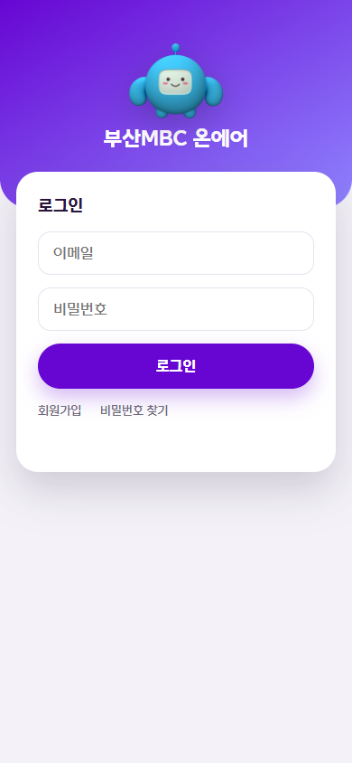
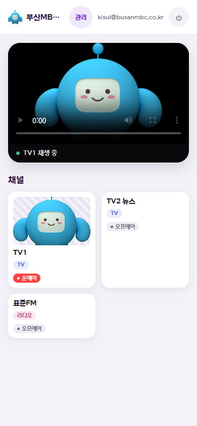
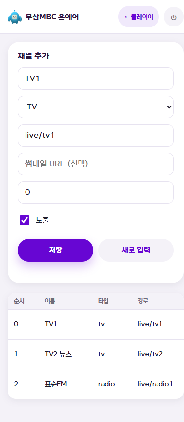

# 부산MBC 온에어 📺

방송국(부산MBC)의 TV/라디오를 **로그인한 시청자가 휴대폰·PC로 실시간 시청**하는 웹앱입니다.
아이폰/안드로이드 홈 화면에 설치하면 **앱처럼(PWA)** 쓸 수 있습니다.

**🔗 라이브: https://mybusanmbc.duckdns.org**

   -4664E6)

---

## 화면

<p align="center">
  
  
  
</p>

<p align="center"><sub>로그인 · 플레이어(채널 목록) · 관리자(채널 CRUD)</sub></p>

---

## 이런 앱이에요

- 🔐 **로그인 시청** — 이메일/비밀번호 로그인(Supabase Auth) 후 채널 재생
- 📡 **실시간 스트리밍** — OBS 송출 → 서버에서 HLS 변환 → 브라우저 재생
- 🟥 **온에어 상태 표시** — 채널별 온에어/오프에어 뱃지
- 🛠 **관리자 채널 관리** — 관리자만 채널 추가/수정/삭제(DB 권한 RLS로 강제)
- 📱 **PWA** — 홈 화면 설치 + 주소창 없는 전체화면
- 🎨 **MBC 브랜드** — 퍼플/마스코트/전용 폰트, 라이트 테마
- 💸 **월 $0** — 무료 인프라·오픈소스만 사용

---

## 동작 구조

```
[방송 PC]                   [Oracle 클라우드 서버 (24h)]                 [시청자]
 OBS ──RTMP(인증)──▶  MediaMTX(:1935→:8888 HLS)  ◀──HTTPS── 브라우저/홈앱
                      Caddy(:443 자동 HTTPS)
                        /        → 정적 프론트(HTML/JS)
                        /live/*  → MediaMTX 프록시
                            ▲
                            ▼  로그인·회원·채널목록
                     Supabase(클라우드: Auth + PostgreSQL)
```

- **같은 도메인(same-origin)** 으로 웹과 영상을 함께 제공 → iOS 사파리 CORS/쿠키 문제 회피.
- 프론트는 재생 주소를 "현재 접속 주소" 기준으로 만들어 **도메인이 바뀌어도 코드 무수정**.

---

## 기술 스택

| 영역 | 사용 기술 | 역할 |
|------|-----------|------|
| 방송 송출 | **OBS Studio** | RTMP로 서버에 영상 전송(스트림 키 인증) |
| 미디어 서버 | **MediaMTX** | RTMP 수신 → HLS 변환(단순 리먹싱, 가벼움) |
| 웹 서버/프록시 | **Caddy** | 정적 서빙 + `/live` 프록시 + 자동 HTTPS |
| 프론트엔드 | **순수 HTML/CSS/JS + hls.js** | 빌드 도구 없음. iOS는 네이티브 HLS 분기 |
| 인증/DB | **Supabase** | 이메일 로그인 + PostgreSQL + RLS 권한 |
| 앱화 | **PWA** | manifest + service worker + 아이콘 |
| 서버/도메인 | **Oracle Cloud + DuckDNS** | Always Free VM(Ubuntu) + 무료 서브도메인 |

---

## 비용 — 현재 월 $0

- **Caddy · MediaMTX · DuckDNS · OBS** → 오픈소스/무료 서비스, **무조건 무료**.
- **Oracle Cloud** → Always Free 등급(무료 VM·디스크·트래픽 10TB/월). *공인 IP는 인스턴스에 붙여둔 채 유지.*
- **Supabase** → Free 플랜(소규모 충분). *7일간 무활동 시 일시정지 → 대시보드에서 재개.*

> 자세한 비용 근거·주의점은 [`docs/프로젝트-개요.md`](docs/프로젝트-개요.md) 7장 참고.

---

## 개발 단계(Phase)

| # | 내용 | 가이드 |
|---|------|--------|
| 1 | 로컬 스트리밍 파이프라인(MediaMTX+OBS) | [README-phase1](README-phase1.md) |
| 2 | 웹 플레이어(hls.js) + 채널 상태 | — |
| 3 | Supabase 로그인 | [README-phase3](README-phase3.md) |
| 4 | 채널 관리(RLS) | [README-phase4](README-phase4.md) |
| 5 | **공개 배포**(Oracle+HTTPS+송출 인증) | [README-phase5](README-phase5.md) |
| 7 | **브랜드 PWA** + 디자인 고도화 | [README-phase7](README-phase7.md) |
| 6 · 8 | (예정) 스트림 접근제한 · 운영 모니터링 | — |

---

## 저장소 구조

```
frontend/            웹앱(정적): index/player/admin.html, css, js, fonts, images, icons,
                     manifest.json, service-worker.js
deploy/              서버 설정: Caddyfile.prod, mediamtx.prod.yml, mediamtx.service
tools/               아이콘/마스코트 생성 스크립트(Pillow)
docs/                설계·계획·개요 문서, 스크린샷
test/                순수 함수 단위 테스트(Node)
README-phaseN.md     단계별 실행 가이드
```

---

## 로컬 실행(개발)

```bash
# 미디어 서버 + 웹 서버 실행 (Windows 기준)
./bin/mediamtx.exe ./mediamtx.yml
./bin/caddy.exe run --config Caddyfile
# 브라우저: http://localhost:8080/  (OBS는 rtmp://localhost:1935/live/tv1 로 송출)
```
> `frontend/js/config.js`(Supabase 키)는 gitignore라 로컬/서버에만 존재. 예시는 `config.example.js`.

---

## 배포 반영(운영)

```bash
# 서버 SSH 접속 후
cd /opt/mbc-app && sudo git pull
sudo chmod -R a+rX /opt/mbc-app/frontend
# 프론트가 바뀌었으면 service-worker.js의 캐시 버전(vN)을 올려 재방문자에게 반영
```

---

<sub>순수 웹 기술 + 무료 인프라로 만든 방송 스트리밍 앱. 자세한 내용은 [`docs/프로젝트-개요.md`](docs/프로젝트-개요.md).</sub>
